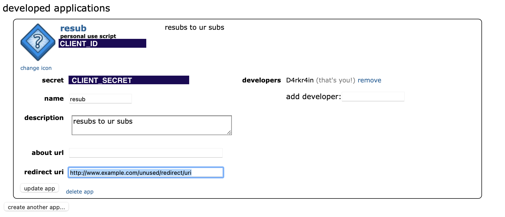

# resub
Resubscribes to your subreddits because Reddit Devs broke something

# how to use

1. Get list of subs through source inspector. This does require a little bit of luck, as we know the subs sporadically appear then disappear. When they do appear, you can get the list of subs
    
    

    Shift select to get list
    

2. Put these into bin/subs.txt in that format (at this moment it won't take any other format)

3. Create an app at [this link](https://www.reddit.com/prefs/apps). for app name, you can put resub and put whatever you want for description. You can leave about url blank, and for redirect uri you can put 'http://www.example.com/unused/redirect/uri'



4. Now to configure the script. Go to bin/script.py. Under client_id and client_secret, put the text you get from the app you created
    ```reddit = praw.Reddit(
    client_id="INSERT_CLIENT_ID",
    client_secret="INSERT_CLIENT_SECRET",
    password="INSERT_USER_PASSWORD",
    user_agent="testscript by u/d4rkr4in",
    username="INSERT_USERNAME",
    )
    ```
    

    Don't forget to put your password and username. Also, if you have 2FA enabled, you have to disable it. [Reddit oauth does not play nice with 2fa](https://praw.readthedocs.io/en/latest/getting_started/authentication.html)

5. One more thing before running the script, you have to install the 'praw' library. Run this in the terminal: 
    ```pip3 install praw```
    
6. Run script.py and it will re-subscribe you to all your subs!!

